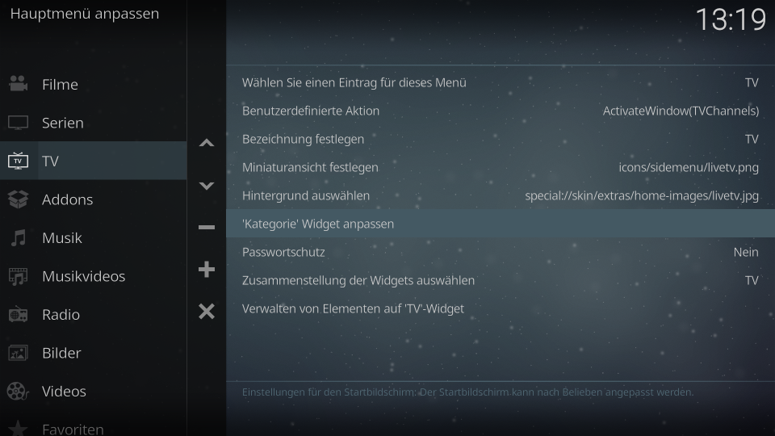
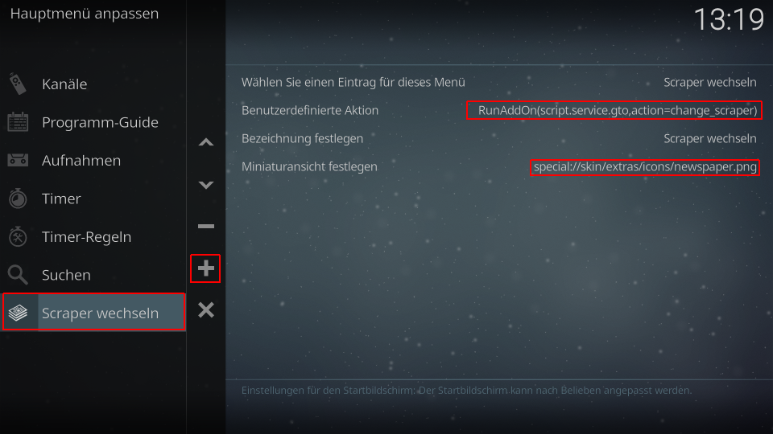

Skinintegration into Estuary MOD V2 (Kodi 18+)
----------------------------------------------

If You want to use the plugin as widget you have to perfom following steps. The example described here is an example under Linux. All files resides in folder 'integration/skin.estuary' of the addon:

1. Copy the widget XML into the skin XML folder:

        cd $HOME/.kodi/addons/script.service.gto/integration/
        cp skin.estuary/gto-widget.xml $HOME/.kodi/addons/skin.estuary.modv2/xml/

2. Register the widget as include:

        nano $HOME/.kodi/addons/skin.estuary.modv2/xml/Includes_Home.xml
        
   Insert in line 3 (after `<includes>`):
   
        <include file="gto-widget.xml"/>

   Save changes and exit.
   
3. Insert the widget into the PVR section of the Home screen

        nano $HOME/.kodi/addons/skin.estuary.modv2/xml/Home.xml
        
 Search for the PVR section near line 740. Use `include content="WidgetListChannels"` as search item and include after the last matched item behind `</include>` (should be line 750):

        <include content="WidgetListGTO" condition="System.HasPVRAddon + System.HasAddon(script.service.gto)">
            <param name="content_path" value="plugin://script.service.gto?action=getcontent&amp;ts=$INFO[Window(Home).Property(GTO.timestamp)]"/>
            <param name="widget_header" value="$ADDON[script.service.gto 30104]: $INFO[Window(Home).Property(GTO.Provider)]"/>
            <param name="widget_target" value="pvr"/>
            <param name="list_id" value="12500"/>
            <param name="label" value="$INFO[ListItem.label2]$INFO[ListItem.Property(StartTime), (,)]"/>
            <param name="label2" value="$INFO[ListItem.label]"/>
        </include>
        
 Example. The first include is the include from original, the sec ond is the new GTO widget:

    <include content="WidgetListChannels" condition="System.HasPVRAddon + !Skin.HasSetting(hide_allchannels)">
        <param name="content_path" value="pvr://channels/tv/*"/>
        <param name="widget_header" value="$LOCALIZE[40161]"/>
        <param name="widget_header_focus" value="$INFO[Container(12400).ListItem.Label, | ]"/>
        <param name="widget_target" value="pvr"/>
        <param name="list_id" value="12400"/>
        <param name="item_limit" value="2000"/>
        <param name="label" value="$INFO[ListItem.ChannelName]"/>
        <param name="label2" value="$INFO[ListItem.Title]$INFO[ListItem.Season, - ,x]$INFO[ListItem.Episode,,.]$INFO[ListItem.EpisodeName, ]"/>
    </include>
    <include content="WidgetListGTO" condition="System.HasPVRAddon + System.HasAddon(script.service.gto)">
        <param name="content_path" value="plugin://script.service.gto?action=getcontent&amp;ts=$INFO[Window(Home).Property(GTO.timestamp)]"/>
        <param name="widget_header" value="$ADDON[script.service.gto 30104]: $INFO[Window(Home).Property(GTO.Provider)]"/>
        <param name="widget_target" value="pvr"/>
        <param name="list_id" value="12500"/>
        <param name="label" value="$INFO[ListItem.label2]$INFO[ListItem.Property(StartTime), (,)]"/>
        <param name="label2" value="$INFO[ListItem.label]"/>
    </include> 
        
4. Save it. You are already done!

5. If you want to include an icon for changing the scraper module, the easiest method is to modify the menu in this way:

- Goto System (gear on top) -> Interface -> Skins -> Configure skin
- Modify main menu -> select TV Item on the left
- select 'modify category widget' on the right
- add (+) an entry and modify it:

- user defined action: RunAddon(script.service.gto,action=change_scraper)
- define a name and an icon for the action. You could use the newspaper icon as a symbol of a papered guide. See screenshots below.

