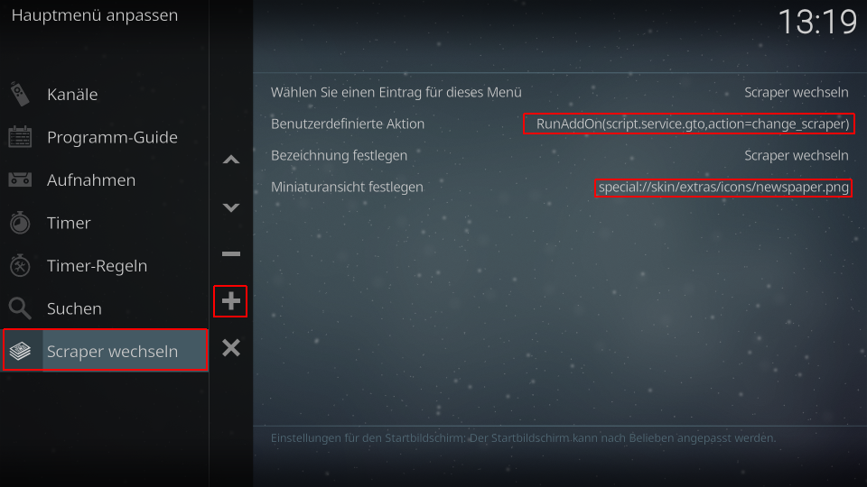

Skintegration in Estuary:
----------------------------

Um die TV Highlights des Tages in Estuary zu integrieren sind folgende Schritte erforderlich (als Beispiel dient hier die Integration unter einer Linux-Distribution). Die zum Kopieren erforderlichen Dateien befinden sich im Ordner 'integration/skin.estuary':

If You want to use the plugin as widget you have to perfom following steps. The example described here is an example under Linux. All files resides in folder 'integration/skin.estuary' of the addon:

        cd $HOME/.kodi/addons/script.service.gto/integration/

1. Kopieren des Scraper-Icons und des Widgets in den Skin Ordner / Copy skin icon and widget to Estuary folder:

        sudo mkdir -p /usr/share/kodi/addons/skin.estuary/extras/icons
        sudo cp icons/*.png /usr/share/kodi/addons/skin.estuary/extras/icons/
        sudo cp skin.estuary/gto-widget.xml /usr/share/kodi/addons/skin.estuary/xml/

2. Das Widget als include anmelden / Register the include:

        sudo nano /usr/share/kodi/addons/skin.estuary/xml/Includes_Home.xml
        
   In Zeile 3 einfügen (nach `<includes>`) / Insert in line 3 (after `<includes>`):
   
        <include file="gto-widget.xml"/>

    Speichern und beenden. Save changes and exit
    
3. Das Widget in den PVR-Bereich des Skins einbinden / Insert the widget into the PVR section of the skin.
   Dazu die Home.xml öffnen und nach den PVR Includes suchen / Open the Home.xml and search for the PVR includes.
   
        sudo nano /usr/share/kodi/addons/skin.estuary/xml/Home.xml
        
    Nach den PVR-Includes suchen (ca. Zeile 370) /  Search for the PVR includes near line 370.
    Als Suchbegriff folgendes verwenden / Use following text as search item: 
   
        <include content="WidgetListCategories" condition="System.HasPVRAddon">
            
    Jedes Widget hat folgende Struktur, die Widgetliste wird mit `</control>` abgeschlossen / Every widget has a same structure, widget list is closed with a `</control>` tag.
    Vor dem `</control>`-Tag einfügen / Insert before `</control>` tag:
     
        <include content="WidgetListGTO" condition="System.HasPVRAddon + System.HasAddon(script.service.gto)">
            <param name="content_path" value="plugin://script.service.gto?action=getcontent&amp;ts=$INFO[Window(Home).Property(GTO.timestamp)]"/>
            <param name="widget_header" value="$ADDON[script.service.gto 30104]: $INFO[Window(Home).Property(GTO.Provider)]"/>
            <param name="widget_target" value="pvr"/>
            <param name="list_id" value="12400"/>
            <param name="label" value="$INFO[ListItem.label2]$INFO[ListItem.Property(StartTime), (,)]"/>
            <param name="label2" value="$INFO[ListItem.label]"/>
        </include>
        
    Abspeichern und nano beenden / Save changes (CTRL-o) and exit (CTRL-x)

Beispiel / Example:
-------------------

        <include content="WidgetListCategories" condition="System.HasPVRAddon">
            <param name="widget_header" value="$LOCALIZE[31148]"/>
            <param name="list_id" value="12900"/>
            <param name="pvr_submenu" value="true"/>
            <param name="pvr_type" value="TV"/>
        </include>
        <include content="WidgetListChannels" condition="System.HasPVRAddon">
            <param name="content_path" value="pvr://channels/tv/*?view=lastplayed"/>
            <param name="sortby" value="lastplayed"/>
            <param name="sortorder" value="descending"/>
            <param name="widget_header" value="$LOCALIZE[31016]"/>
            <param name="widget_target" value="pvr"/>
            <param name="list_id" value="12200"/>
        </include>
        ...
        <include content="WidgetListGTO" condition="System.HasPVRAddon + System.HasAddon(script.service.gto)">
            <param name="content_path" value="plugin://script.service.gto?action=getcontent&amp;ts=$INFO[Window(Home).Property(GTO.timestamp)]"/>
            <param name="widget_header" value="$ADDON[script.service.gto 30104]: $INFO[Window(Home).Property(GTO.Provider)]"/>
            <param name="widget_target" value="pvr"/>
            <param name="list_id" value="12400"/>
            <param name="label" value="$INFO[ListItem.label2]$INFO[ListItem.Property(StartTime), (,)]"/>
            <param name="label2" value="$INFO[ListItem.label]"/>
        </include>
    </control>
    
4. Icon für den Scraperwechsel hinzufügen / Add an icon for the scraper change (optional)

        sudo nano /usr/share/kodi/addons/skin.estuary/xml/Includes_Home.xml
        
    Nach den PVR-Includes suchen (ca. Zeile 438)/ Search for the PVR includes like following (near line 438):
    
        <include name="PVRSubMenuContent">
            <content>
                <item>
                ...
                </item>
                <item>
                ...
                </item>
            </content>
        </include>
        
    Vor dem `</content>`-Tag folgende Item-Gruppe eintragen / Insert before the `</content>` tag:
    
			<item>
                <label>$ADDON[script.service.gto 30110]</label>
                <onclick>XBMC.RunScript(script.service.gto,action=change_scraper)</onclick>
                <thumb>newspaper.png</thumb>
                <visible>System.HasAddon(script.service.gto)</visible>
			</item>
			
5. DefaultDialogButton um weiteren Click erweitern / Extend DefaultDialogButton with 2nd click

        sudo nano /usr/share/kodi/addons/skin.estuary/xml/Includes_Buttons.xml
    
    nach `<include name="DefaultDialogButton">` suchen / search for `<include name="DefaultDialogButton">`
    und innerhalb der control-gruppe den `<onclick>$PARAM[onclick]</onclick>` erweitern / extend within the control group the 2nd `<onclick>$PARAM[onclick]</onclick>`:
      
            <onclick>$PARAM[onclick_2]</onclick>
        
     Beispiel /Example:
     
             <control type="button" id="$PARAM[id]">
                <width>$PARAM[width]</width>
                <height>$PARAM[height]</height>
                <label>$PARAM[label]</label>
                $PARAM[font]
                <textoffsetx>20</textoffsetx>
                <onclick>$PARAM[onclick]</onclick>
                <onclick>$PARAM[onclick_2]</onclick>
                <wrapmultiline>$PARAM[wrapmultiline]</wrapmultiline>
                <align>center</align>
                <texturefocus border="40" colordiffuse="button_focus">buttons/dialogbutton-fo.png</texturefocus>
                <texturenofocus border="40">buttons/dialogbutton-nofo.png</texturenofocus>
                <visible>$PARAM[visible]</visible>
             </control>

			
    Abspeichern und nano beenden. Kodi neu starten / Save and exit nano. Restart Kodi.

Skinintegration into Estuary MOD V2 (Kodi 18+)
----------------------------------------------

If You want to use the plugin as widget you have to perfom following steps. The example described here is an example under Linux. All files resides in folder 'integration/skin.estuary' of the addon:

1. Copy the widget XML into the skin XML folder:

        cd $HOME/.kodi/addons/script.service.gto/integration/
        cp skin.estuary/gto-widget.xml $HOME/.kodi/addons/skin.estuary.modv2/xml/

2. Register the widget as include:

        nano $HOME/.kodi/addons/skin.estuary.modv2/xml/Includes_Home.xml
        
   Insert in line 3 (after `<includes>`):
   
        <include file="gto-widget.xml"/>

   Save changes and exit.
   
3. Insert the widget into the PVR section of the Home screen

        nano $HOME/.kodi/addons/skin.estuary.modv2/xml/Home.xml
        
 Search for the PVR section near line 740. Use `include content="WidgetListChannels"` as search item and include after the last matched item behind `</include>` (should be line 750):

        <include content="WidgetListGTO" condition="System.HasPVRAddon + System.HasAddon(script.service.gto)">
            <param name="content_path" value="plugin://script.service.gto?action=getcontent&amp;ts=$INFO[Window(Home).Property(GTO.timestamp)]"/>
            <param name="widget_header" value="$ADDON[script.service.gto 30104]: $INFO[Window(Home).Property(GTO.Provider)]"/>
            <param name="widget_target" value="pvr"/>
            <param name="list_id" value="12500"/>
            <param name="label" value="$INFO[ListItem.label2]$INFO[ListItem.Property(StartTime), (,)]"/>
            <param name="label2" value="$INFO[ListItem.label]"/>
        </include>
        
 Example. The first include is the include from original, the sec ond is the new GTO widget:

    <include content="WidgetListChannels" condition="System.HasPVRAddon + !Skin.HasSetting(hide_allchannels)">
        <param name="content_path" value="pvr://channels/tv/*"/>
        <param name="widget_header" value="$LOCALIZE[40161]"/>
        <param name="widget_header_focus" value="$INFO[Container(12400).ListItem.Label, | ]"/>
        <param name="widget_target" value="pvr"/>
        <param name="list_id" value="12400"/>
        <param name="item_limit" value="2000"/>
        <param name="label" value="$INFO[ListItem.ChannelName]"/>
        <param name="label2" value="$INFO[ListItem.Title]$INFO[ListItem.Season, - ,x]$INFO[ListItem.Episode,,.]$INFO[ListItem.EpisodeName, ]"/>
    </include>
    <include content="WidgetListGTO" condition="System.HasPVRAddon + System.HasAddon(script.service.gto)">
        <param name="content_path" value="plugin://script.service.gto?action=getcontent&amp;ts=$INFO[Window(Home).Property(GTO.timestamp)]"/>
        <param name="widget_header" value="$ADDON[script.service.gto 30104]: $INFO[Window(Home).Property(GTO.Provider)]"/>
        <param name="widget_target" value="pvr"/>
        <param name="list_id" value="12500"/>
        <param name="label" value="$INFO[ListItem.label2]$INFO[ListItem.Property(StartTime), (,)]"/>
        <param name="label2" value="$INFO[ListItem.label]"/>
    </include> 
        
4. Save it. You are already done!

5. If you want to include an icon for changing the scraper module, the easiest method is to modify the menu in this way:

- Goto System (gear on top) -> Interface -> Skins -> Configure skin
- Modify main menu -> select TV Item on the left
- select 'modify category widget' on the right
- add (+) an entry and modify it:

- user defined action: RunAddon(script.service.gto,action=change_scraper)
- define a name and an icon for the action. You could use the newspaper icon as a symbol of a papered guide. See screenshots below.

